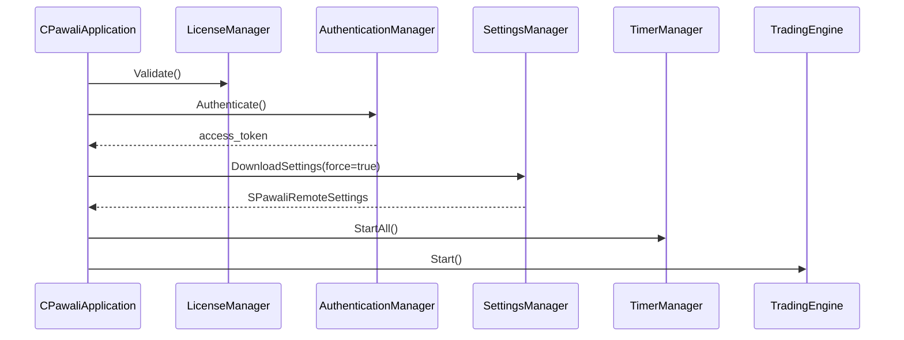

# PawaliEA Enterprise Architecture

## Design Principles

1. **Separation of concerns** — API, core orchestration, trading, and utilities are isolated.
2. **Dependency injection** — Managers receive collaborators via `Init()`; no hidden singletons inside modules.
3. **Interface-driven boundaries** — Transport, auth, sync, commands, and settings use abstract contracts.
4. **Offline-first reliability** — All mutating API calls can be queued with idempotency keys.
5. **Hot configuration** — Settings reload when version changes or on remote command without restart.

## Layer Diagram

```
PawaliEA.mq5
    └── CPawaliBootstrap
            └── CPawaliApplication
                    ├── CPawaliLogger
                    ├── CPawaliApiClient            (HTTP transport)
                    ├── CPawaliAuthenticationManager
                    ├── CPawaliOfflineQueueManager
                    ├── CPawaliSettingsManager
                    ├── CPawaliLicenseManager
                    ├── CPawaliHeartbeatManager
                    ├── CPawaliCommandManager
                    ├── CPawaliTradeSyncManager
                    ├── CPawaliDecisionSyncManager
                    ├── CPawaliMarketDataCollector
                    ├── CPawaliTimerManager
                    ├── CPawaliDiagnostics
                    ├── CPawaliDebugPanel
                    └── CPawaliTradingEngine (placeholder)
```

## Module Responsibilities

| Module | Responsibility |
|--------|----------------|
| `AuthenticationManager` | `/api/auth`, token lifecycle, refresh |
| `ApiClient` | WebRequest wrapper, retry, timeout, bearer headers |
| `SettingsManager` | `/api/settings`, cache, observer notifications |
| `HeartbeatManager` | `/api/heartbeat`, account + terminal telemetry |
| `CommandManager` | `/api/commands`, dispatch + completion callback |
| `TradeSyncManager` | `/api/trades`, pending trade replay |
| `DecisionSyncManager` | `/api/decisions`, pending decision replay |
| `OfflineQueueManager` | Persistent queue + dedupe store |
| `LicenseManager` | Local + server license state |
| `TimerManager` | Heartbeat/command/sync scheduling |
| `Diagnostics` | Runtime health snapshots |
| `DebugPanel` | On-chart operational status |
| `TradingEngine` | Strategy placeholder (future phase) |

## Startup Flow



## Timer Loop

Every 1 second (`EventSetTimer(1)`):

- **Heartbeat** — every 60s → `POST /api/heartbeat`
- **Commands** — every 15s → `GET /api/commands` + complete
- **Sync** — every 30s → flush queue, trade sync, decision sync, token refresh

## Settings Hot Reload

`CPawaliSettingsManager` compares remote `version` with cached version.

Reload triggers:

- Startup (`DownloadSettings(true)`)
- Remote command `UPDATE_SETTINGS` / `FORCE_SYNC`
- Version mismatch on periodic poll

Observers implement `IPawaliSettingsObserver::OnSettingsUpdated()`.

## Offline Queue

Queue item fields:

- `id`, `type`, `method`, `endpoint`, `payloadJson`
- `idempotencyKey` — persisted in `dedupe_keys.txt`
- `attempts`, `nextRetryAt` — exponential backoff

Replay order: FIFO with retry scheduling.

## Logging Channels

| Channel | File |
|---------|------|
| Expert | `Expert.log` |
| API | `API.log` |
| Trade | `Trade.log` |
| Error | `Error.log` |
| Performance | `Performance.log` |

## Extension Points (Future Phases)

- Implement strategy inside `CPawaliTradingEngine`
- Push decisions via `CPawaliDecisionSyncManager::QueueDecision()`
- Push closed trades via `CPawaliTradeSyncManager::QueueTrade()`
- Register indicators in `CPawaliIndicatorRegistry`

## Global State Policy

MT5 requires global event handlers. The only global object is `CPawaliBootstrap PawaliBootstrap` in `PawaliEA.mq5`. All business logic lives inside `CPawaliApplication` and composed managers.
